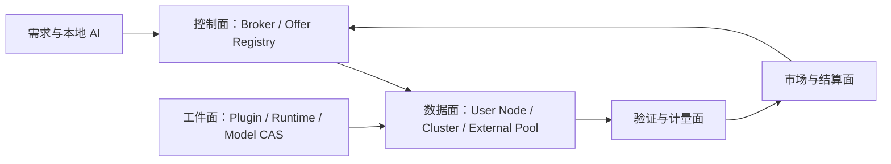
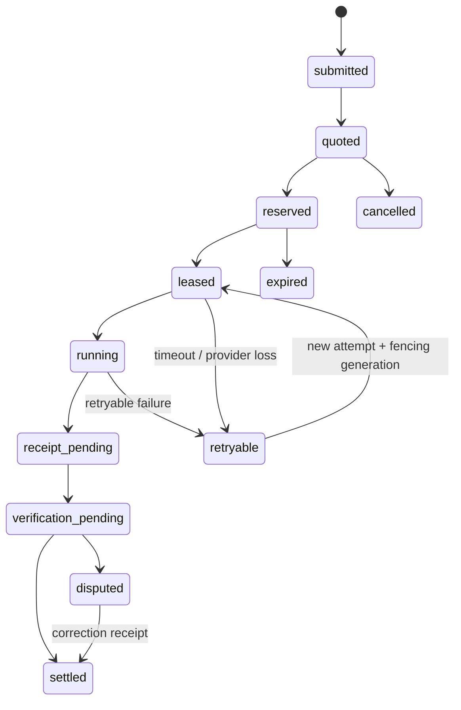

# 分布式算力联邦架构

## 1. 边界

一龙聚合的是可验证的 AI 工作负载和容量，不把高延迟、频繁掉线、显存不同的公网设备直接伪装成同一张 GPU。

公网用户节点适合完整承载一个模型副本或一个独立分片任务，例如对话推理、Embedding、重排、图像生成、视频片段、评测样本和可检查点批任务。需要 NVLink、RDMA 或稳定低延迟互联的大模型张量并行、流水线并行，由一个受管集群在内部完成；一龙只把该集群视为单个逻辑 Provider。

## 2. 三类 Provider

| Provider | 内部形态 | 一龙看到的边界 |
|---|---|---|
| `user_node` | 用户 PC、工作站或家用服务器 | 单节点插件、可用模型、容量和策略 |
| `managed_cluster` | 自建或合作方 GPU 集群 | 一个逻辑供给方，可在内部做多 GPU 并行 |
| `external_pool` | 云平台、其他矿池或公司算力 API | 由服务端 Adapter 翻译报价、任务和回执 |

核心层只依赖 `ComputeProvider` 能力，不直接依赖 Ollama、CUDA 云厂商或具体矿池 API。

## 3. 五个平面



### 控制面

负责 Provider 注册、Offer 版本、能力发现、标准化报价、候选排序、Reservation、Attempt Lease、超时重试和取消。控制面只派发合同，不搬运所有模型字节。

### 数据面

负责输入交付、实际执行、流式事件、检查点和结果回传。大对象使用对象存储或内容寻址传输，控制通道只传引用、摘要和短事件。

### 工件面

分别管理插件、运行时和模型。三者都有独立摘要、版本、依赖、磁盘配额和回收策略，不能把模型权重打进节点可执行插件。

### 验证与计量面

分别保存 Provider 声明、平台观测和验证结果，通过服务端重新分词、确定性复算、抽样副本、挑战任务、输出摘要和历史信誉得出最终可结算用量。

### 市场与结算面

维护 Compute SKU、价格曲线、不可变 Price Snapshot、容量合约、消费者应付、Provider 应得、平台价差、待确认余额和最终 Settlement Receipt。

## 4. 核心合同

### ComputeProvider

稳定身份、Provider 类型、所有者、状态、信任等级和 Adapter 引用。`ComputeProviderCapabilities` 只表达任务种类、加速器、区域、数据等级、流式与检查点等稳定支持包络，不携带并发数、当前可用量或可出售容量。瞬时供给和商业承诺由 Offer 表达。

### ComputeOffer

Provider 发布的不可变版本，包含支持的任务类型、模型/工件摘要、运行时、精度、上下文档位、容量、区域、交付窗口、价格来源和可用期限。`execution_limits` 是该 Offer 最大并发 Attempt 与单次最长运行时间的唯一合同权威；本机策略可以更严格地降额或拒绝，但不能扩大 Offer。

每个 meter 的 capacity 行只声明该 Offer 版本发布时的 `total_units` 和 `reservable_units`，不保存实时 `committed` 或剩余数量。发布、复制或续期 Offer 不会铸造容量。更新供给条款必须创建新版本；真实的发行、持有、预留、承诺、消费和释放数量由后续原子容量账本维护，不能回写不可变 Offer。

### CapacityPool 与容量账本

共享 CapacityPool 和追加式容量账本已经成为已接受设计，权威决定见 `docs/decisions/distributed-compute-capacity-ledger-v1.md`，完整对象与事务边界见 `docs/distributed-compute/capacity-ledger.md`。CapacityPool 表达会互相争用的物理资源边界，不保存实时余额；同一物理资源的全部 Offer 必须绑定同一 pool/epoch/bucket，防止跨模型、SKU 或销售渠道重复出售。

V1 一份 Reservation 只绑定一个 Pool、一个精确 DeliveryWindow 和多个 meter。窗口统一为规范 UTC 半开区间 `[starts_at, ends_at)`；真实余额由不可变 ledger transaction/leg 与可重建投影共同维护。领域合同、checked-i128 reducer、v165-v195 SQLite schema，以及容量、Provider、Offer、Price Snapshot、Job、Reservation 和 Attempt v185-v195 Store 已写入但未编译、未执行迁移。v175/v176 已形成平台人民币余额 Broker；v185-v193 形成激活与多方证据；v194 原子推进可信终态并收口容量；v195 结清消费者 CNY 预授权并登记 Provider/平台 pending 收益，但尚无释放、提现或外部资金效果。本人 HTTP/MCP 可生成 fallback_curve 快照但未运行，真实价格源和完整节点运行协议仍未实现。

### WorkloadSpec

与 Provider 无关的需求合同：任务种类、输入工件引用、模型约束、输出约束、最大预算、交付期限、检查点策略、验证策略和数据放置要求。

### ComputeJob

用户需求的持久身份。Job 保存所选 Offer 版本、Price Snapshot、预算和状态，但不等同于某次机器执行。

当前 v172 Registry 已实现 `submitted -> quoted -> reserved -> running -> verification_pending -> settled` 的受限主路径及失败/取消终态，保存当前投影和不可变历史版本。每次写入和读取都会复核 Workload、Provider 范围、消费者预算以及 Offer/Price Snapshot/Provider 历史链；消费者幂等键和 revision/digest CAS 防止重复或并发覆盖。quoted 可以显式刷新锁价选择，离开 quoted 后不得更换。该实现状态为 `implementation_uncompiled`；HTTP/MCP 可提交、报价并按本人或当前项目读取最新 Job/Reservation，v175/v176 Broker 组合预留和未执行终态，v185 可把外部已接受的首个 Attempt 与 `reserved -> running` 原子绑定。真实派发和运行验证尚未接线。

### ComputeReservation

在派发前原子占用所选 Offer 背后的容量和消费者预算。Reservation 有明确的到期时间；失败或到期后幂等释放。实时剩余量必须从所选 Pool 和精确半开窗口的原子容量账本得出，而不是从 Provider 包络、Offer 静态字段或候选观察结果反推。

当前 `implementation_uncompiled` 的 v173/v174 已形成 Capacity Claim 不可变版本历史和 ComputeReservation 版本注册表。Reservation 精确绑定 Job、Offer、Price Snapshot 与 Claim revision/digest，使用消费者级幂等、`expected_revision`、revision/digest CAS、受限状态机和完整历史依赖审计。该 Store 只验证并登记调用方已经准备好的依赖，不会自行 hold Claim、冻结或退回消费者预算，也不移动账本余额，因此不能把独立 `register_compute_reservation` 描述成原子 Broker。原子业务入口位于 v175 Reserve 与 v176 未执行任务 Finish；后者拒绝任何已经离开 held 状态的 Claim，不能用于运行中 Attempt。

### ComputeAttemptLease

一次具体执行尝试。每次重试递增 `attempt_no` 和 `fencing_generation`，续租不能复活已过期尝试。迟到结果可以留作审计，但不能覆盖拥有更高 `fencing_generation` 的结果。秘密租约凭据只用于鉴权，不承担代次语义。

NodeAgent Host 内部已形成 Attempt command 与 typed event 合同：`start`、`renew_lease`、`cancel` 命令绑定不可变 Attempt 身份、Offer、Runner、模型、资源限制和截止时间；Runner 事件不自带可信 Attempt 身份，由 Host 根据活动命令补写租约、Attempt 编号和 `fencing_generation`。云端 v185-v194 覆盖 Attempt 激活、证据、Verification、Execution Receipt、可信终态与容量效果，v195 保存首份 CNY 待结算回执。v185-v195 均不发送节点命令、不验证外部证明签名或调用外部资金网络。两侧尚未通过 outbox、线协议或 Sidecar IPC 接通，不能视为通用任务通道已经可用。

### ExecutionReceipt

至少拆成三层：

- `declared_usage`：Provider 或插件声明的消耗；v188 已写入累计快照 Store/HTTP，但仍是未编译且未验证的证据；
- `observed_usage`：控制面、传输层和计时器观测的事实；
- `verified_usage`：验证策略接受的最终可计量事实。

Receipt 同时绑定 Job、Attempt、Offer、插件摘要、模型摘要、输入摘要、输出摘要和时间窗，避免回执被移用到另一笔任务。

v189 的 Provider 终态候选只固定 Lease、当前业务因果链、最新声明用量与结果工件摘要，是未来构造 Receipt 的输入证据之一；它不包含平台观测和验证决定，不能直接作为 Execution Receipt。

v190 的消费者审核把 `accepted/rejected/disputed` 与精确 v189 候选绑定，是另一项独立验证输入。消费者不能覆盖 Provider 候选，平台也不能把 `accepted` 直接解释为 verified usage、可信终态或付款授权。

v191 的平台观测把 control plane、transport gateway 或 server metering 的累计 meter 与同一候选绑定，并显式保存差异 meter。该证据仍需 Verification policy 评估来源、签名、重复执行和争议状态，不能直接写入 `verified_usage`。

v192 的 `conservative_min_v1` 首次把精确 v189-v191 证据裁决为 accepted/rejected/disputed，并确定 verified/compensable usage。它仍是独立验证回执，不是 Execution Receipt；来源可信、挑战与争议、任务终态、容量消费和资金结算仍需后续阶段完成。

v193 仅把 accepted v192 与 Attempt 激活、Job/Reservation 历史、运行工件和用量组合为不可变 Execution Receipt。回执读取时重建并重算摘要，但它仍只是后续状态机和 Settlement 的输入，不直接更新任何状态或账本。

v194 仅接受由 accepted Verification 签发的精确 v193 Execution Receipt，并在单一事务内应用可信终态与容量收口。consumable meter 的 compensable usage 进入 consumed、余量归还 available；reusable meter 全量归还但仍保留可结算用量。Job 停在 `verification_pending`，消费者预授权和 Provider 收益不变。

v195 以 v194/v193 和不可变 Price Snapshot 为输入，在单一事务内按 verified usage 结清消费者 CNY 预授权、按 compensable usage 登记 Provider pending 收益、退回未用余额并把 Job 推进 `settled`。首版拒绝非空 `fee_rules`；Provider/平台 pending 账本与现有消费者余额分离，尚无可用期、争议、释放、提现或外部资金效果。

### PriceSnapshot 与 SettlementReceipt

Price Snapshot 冻结报价来源、交付窗口、消费者价格腿、Provider 价格腿、币种/积分单位和费用规则。Settlement Receipt 只引用快照与验证用量，不能回头读取“当前价格”重算历史任务。

当前 v171 Registry 已把规范校验接入不可变快照登记与读取：按快照 ID 精确幂等重放，quote ID 唯一，读取复核历史 Offer，数据库拒绝更新和删除。本人 HTTP/MCP 可从 active Offer 生成 fallback_curve 快照；真实价格源、期货曲线和自动撮合仍未实现。v175 Broker 会复核并锁定 Job 已选择的既有快照，但不在 Reserve 事务内生成报价。

## 5. 标准任务生命周期



Job 状态与 Attempt 状态分离。Job 失败不意味着所有 Attempt 记录消失；重试也不覆盖历史 Attempt。

## 6. Provider Adapter

服务端统一 Adapter 行为：

```text
sync_offers -> quote -> reserve -> submit -> renew/events
                                      |-> cancel
                                      |-> fetch_receipt
                                      `-> reconcile
```

Adapter 必须把外部错误归一为稳定错误码，并保存原始 Provider 引用以便对账。外部矿池凭据只存在服务端或专用网关；普通用户节点不需要安装每家公司的 SDK。

## 7. 调度原则

调度先做硬过滤，再做软排序：

1. 任务类型、模型/工件、精度、上下文、交付窗口和插件摘要满足要求；
2. Offer 仍有效且 Reservation 容量充足；
3. Provider 信任等级满足验证策略；
4. 总锁定价格不超过预算；
5. 在价格、完成概率、延迟、数据传输成本和供给分散度之间排序。

大型请求由上层 Planner 拆成独立可重试分片。Broker 不在第一个版本中承担任意图调度；每种任务先拥有稳定的 Shard 与 Merge 规则。

## 8. 与现有实现的关系

现有节点模型共享继续提供 `llm_chat` 兼容供给，其白名单、每日 Token 预留、流租约和账本不被删除。新的 Federation 层先把它映射为 Provider、Offer、Job 和 Receipt，再逐步把直接路由迁移到 Broker。

兼容策略中的节点级 `max_concurrent_runs` 是本机共享安全上限。生成 Federation Offer 时可以据此收紧 `execution_limits`，但同一节点发布多个 Offer 时不得把完整节点并发额度复制成每个 Offer 各自独立可售的容量；跨 Offer 的共同占用必须等待共享容量池与原子账本形成后再承诺。

现有 `LlmStreamRequest` 第一批不升级线协议；只有节点明确上报新 capability 后，服务端才可以发送通用 Compute Job。旧节点始终保留旧路径。

## 9. 当前未验证声明

本文描述目标架构和首批领域合同。2026-08-04 的铺设阶段不执行编译、迁移或端到端验证；Provider/Offer、Attempt command/events、CapacityPool、Claim/Reservation、账本 reducer、Broker Reserve/Finish、v185-v195 Attempt 激活/证据/Verification/Execution Receipt/可信终态/容量收口/待结算回执、登录用户 HTTP 控制面和 v165-v195 schema 都尚未编译或运行验证，数据库迁移也未执行。文档、合同、路由或 migration 文件存在不代表运行时已经采用这些能力。
