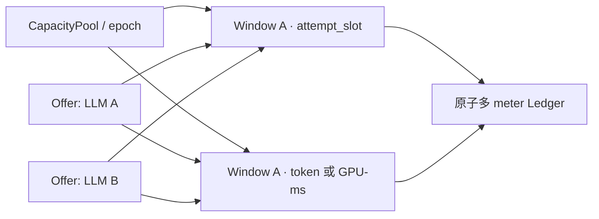

# 分布式算力容量池与账本设计

## 1. 解决的问题

一个节点可以为多个模型发布 Offer，一个集群也可以同时连接一龙、企业客户和外部矿池。市场不能把每条 Offer 当成独立物理容量；所有竞争同一资源的承诺必须落到同一个共享池和追加式账本。



## 2. 对象边界

### CapacityPool

表示一组会互相争用的物理资源。Pool 保存 Provider、稳定身份、当前 epoch、版本摘要、资源档案、区域和支持的 meter，不保存实时余额。节点 GPU、受管集群分区或外部 Provider 配额都可以成为 Pool。

`capacity_epoch` 只在旧容量完全排水或退役后递增。旧 epoch 的 Offer、Claim 和迟到事件保留审计价值，但不能修改新 epoch 余额。

### DeliveryWindow 与 CapacityBucket

`DeliveryWindow` 使用稳定 ID、摘要和 UTC 半开区间。`CapacityBucket` 是 `(pool_id, capacity_epoch, delivery_window_id, meter)` 的唯一余额单元，并记录 meter 是 consumable 还是 reusable。

### ComputeOffer

Offer 引用精确 Pool binding；每条容量行再引用精确 bucket。Offer 只声明愿意出售的静态上限。创建、复制或续期 Offer 都不会修改 bucket 的 `issued` 或 `available`。

### CapacityClaim

Claim 把一组 meter 数量绑定到 Quote hold、Reservation、未来 Commitment、DeliveryAllocation 或 Attempt。它拥有稳定 ID、主体、状态、revision、可选 parent claim 和过期时间，是幂等释放与防止“释放别人的容量”的边界。

当前 Store 的 Hold 必须显式设置 `expires_at`，只允许在交付窗口结束前创建，且 TTL 不得越过窗口结束；一个多 meter Claim 的全部 bucket 必须共享完全相同的窗口边界。窗口结束、TTL 生效和 Expire 授权都以 Store 生成的 `recorded_at` 为权威，调用方 `occurred_at/cutoff_at` 不能伪装未来时间或提前到期。Release/Expire 只接受仍为 `held` 的 Claim，并从该 Claim 自己的 ledger legs 以 checked `i128` 证明每条 held 归属数量且 active 为零。`active` 容量只能由未来绑定 fencing 的 Attempt return/consume 路径推进。

### LedgerTransaction 与 LedgerLeg

Transaction 固定 pool、epoch、window、事件类型、幂等键、请求摘要、业务主体和因果引用，并包含一个或多个 meter line。每个 line 展开成等额双腿；Transaction/Leg 均不可更新或删除。

## 3. 账户与事件

| 事件 | 账户移动 | 典型主体 |
|---|---|---|
| `supply_added` | `issuance -> available` | Pool 容量发行 |
| `supply_withdrawn` | `available -> retired` | 排水后的供给撤出 |
| `reservation_held` | `available -> held` | Quote / Reservation |
| `attempt_activated` | `held -> active` | Attempt Lease |
| `attempt_returned` | `active -> available` | 可复用 slot 正常归还 |
| `usage_consumed` | `active -> consumed` | Token、GPU-ms 等消耗量 |
| `reservation_released` | `held -> available` | 取消或显式释放 |
| `reservation_expired` | `held -> available` | 到期恢复器 |

未来 CapacityCommitment 同样进入 `held`，但使用独立 claim kind。将 Commitment 切给具体 DeliveryAllocation 时先转移 Claim 归属；实际 Attempt 激活后才进入 `active`。

## 4. 原子 Reserve

本地供给的最终 Reserve 是市场线性化点：

1. 以 Job 范围幂等键查重并比对 request digest；
2. 重新读取精确 Offer、Provider、授权、交付窗口和价格来源；
3. 按稳定 meter 顺序对共享 bucket 做条件扣减；
4. 追加一笔多 meter ledger transaction，创建或推进 Claim；
5. 同事务冻结消费者预算并创建不可变 PriceSnapshot；
6. 创建 Reservation，把 Job 绑定到精确 Offer 与快照；
7. 写幂等结果并提交。

任何一步失败全部回滚。候选查询、Quote 和 ReadyCapability 只提供观察事实，不能跳过 Reserve 的再次检查。

## 5. Attempt 与容量

Attempt 创建在独立事务中把 Reservation Claim 从 `held` 推到 `active`，同时检查：

- 当前时间位于所选交付窗口；
- hard deadline 不晚于窗口结束；
- Offer 活跃 Attempt 未超过 `execution_limits.max_concurrent_attempts`；
- Pool 的 `attempt_slot` 等可复用 meter 仍与 Claim 一致；
- `(job_id, shard_key)` 的 attempt number 与 fencing generation 单调递增。

派发只写 outbox，网络发送发生在提交后。失败重发同一 command ID/digest，不能因一次 WebSocket 超时创建新 Attempt。

## 6. 余额守恒

每个 bucket 持有可原子更新的余额投影：

```text
consumable: issued = available + held + active + consumed + retired
reusable:   issued = available + held + active + retired
```

更新前后都检查非负和守恒，算术使用 checked `i128`。`balance_revision` 每次成功事务递增；调用方可以携带预期 revision 做 CAS，但数据库事务仍是最终权威。

## 7. 到期、恢复与对账

- Quote hold、Reservation 和 Commitment 都有明确 expires_at；
- 恢复器按 Claim 而非汇总余额追加 release/expired transaction；
- 相同 effect 使用唯一幂等键，不会重复归还；
- 当前代码级重放返回当前 Claim/余额，尚未保存不可变首次响应；调用方 request digest 也尚未由 Store 规范计算，这两项不能被描述为严格幂等闭环；
- 账本与余额投影不一致时停止新 Reserve，重放 ledger 重建投影并形成审计报告；
- 旧 epoch、旧 fencing generation 和晚到终态只能追加审计，不能影响当前余额。

## 8. 外部矿池

远程 reserve 使用 pending saga。数据库先保存本地 provisional hold 与 adapter outbox，Worker 用固定远程幂等键调用；成功后激活，失败或超时追加释放并发出补偿 cancel。任何网络请求都不在 SQLite 写事务内执行。

## 9. 当前实现边界

2026-08-04 本文与 ADR 已接受；领域合同、checked-i128 reducer、v165-v171 SQLite schema，以及隔离的本地 Store 已经形成。Store 当前覆盖池版本与 bucket 登记、多 meter 供给发行/撤出、窗口与 TTL 有界的 Claim hold、Claim-local held-only 释放/到期、双分录落库、余额 CAS、只读账本重算、有界到期批处理、状态门卫、追加式生命周期、排空后的 epoch 轮换、版本化 Provider/Offer 注册和历史审计，以及不可变 Price Snapshot 登记与读取。Offer 只保存静态销售上限并交叉核验真实 bucket，不成为实时余额真源；Price Snapshot Registry 接收已构造快照，不生成报价，也不与容量/预算原子锁定。这些新增路径尚未编译、执行迁移、调度、并发验证或真实容量操作。Hold/Finish 的 causal binding 当前仍为空，standalone Reservation/Commitment 不等于与预算、Price Snapshot、Reservation 原子完成的 Broker Reserve。Offer 发现/撮合、价格源与报价生成、统一 Reserve、Attempt 激活、canonical Claim 请求摘要、不可变 Claim 首次响应、事务内 Broker API、受控自动修复和运行协议仍未写入或接线。
